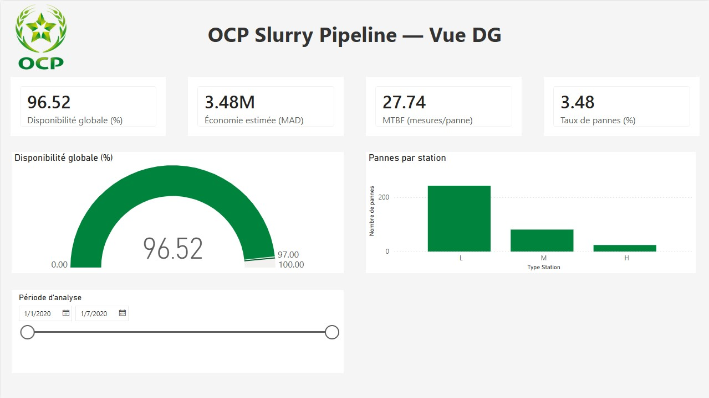
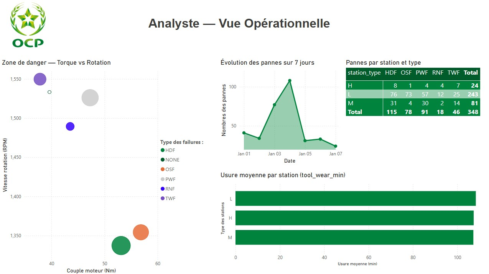
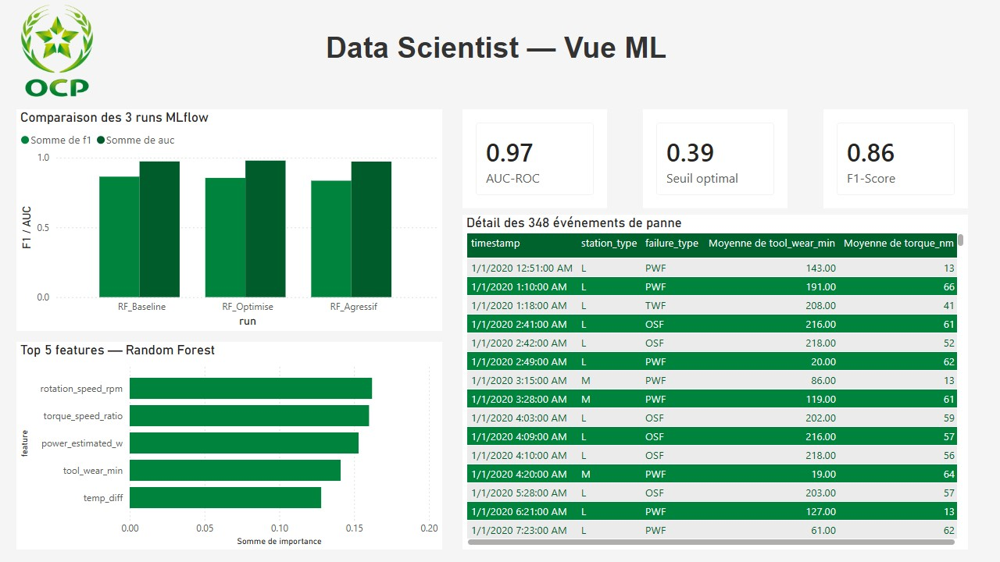

# OCP Slurry Pipeline — Predictive Maintenance Platform

**Pipeline de données End-to-End | Azure + Databricks + Power BI + ML**

[](https://github.com/meriem-merbouhi/ocp-slurry-pipeline/actions)

---

## Problématique

OCP (Office Chérifien des Phosphates) transporte le phosphate via un pipeline slurry de plusieurs centaines de kilomètres. Chaque panne de pompe coûte des millions de dirhams par heure.

**Question centrale : Comment anticiper une panne avant qu'elle se produise ?**

---

## Architecture — Pipeline Medallion

```
Données capteurs (CSV)
        ↓
[Bronze] ADLS Gen2 — données brutes intactes
        ↓  PySpark ETL (nettoyage IQR + SLA > 95%)
[Silver] Databricks — données propres + feature engineering
        ↓  11 nouvelles variables physiques dérivées
[Gold]   Star Schema — 5 tables analytiques Delta Lake
        ↓
[ML]     Random Forest — F1=0.864 / AUC=0.973 / Seuil=0.39
        ↓
[API]    FastAPI + Docker — endpoint /predict temps réel
        ↓
[BI]     Power BI DirectQuery — 3 dashboards (DG / Analyste / DS)
```

---

## Stack Technique

| Couche | Technologies |
|--------|-------------|
| Cloud | Azure ADLS Gen2, Azure Data Factory |
| Traitement | Azure Databricks, PySpark, Python 3.12 |
| ML | Scikit-learn, Random Forest, MLflow |
| API | FastAPI, Docker, Pydantic |
| BI | Power BI DirectQuery, DAX |
| CI/CD | GitHub Actions |

---

## Résultats

| Métrique | Valeur | Objectif | Statut |
|----------|--------|----------|--------|
| Disponibilité pipeline | **96.52%** | > 97% | Proche cible |
| F1-Score ML | **0.864** | > 0.85 | ✅ Atteint |
| AUC-ROC | **0.973** | > 0.92 | ✅ Atteint |
| Précision pannes | **0.947** | — | ✅ Excellent |
| Recall pannes | **0.794** | — | ✅ Bon |
| Seuil optimal | **0.39** | 0.50 défaut | ✅ Calibré |
| Pannes détectées | **348 / 10 000** | — | ✅ Validé |
| SLA qualité Silver | **> 95%** | > 95% | ✅ Atteint |
| Tests CI/CD | **6/6** | 100% | ✅ Badge vert |

---

## Dashboards Power BI

### Vue Directeur Général — Disponibilité & KPIs stratégiques



> Disponibilité 96.52% vs cible 97% | MTBF 27.74 | Station L = 70% des pannes

---

### Vue Analyste — Analyse opérationnelle des pannes



> Zone de danger : torque > 50Nm + rotation < 1400 RPM | Pic de 100 pannes le 5 janvier | Station L + OSF = priorité maintenance

---

### Vue Data Scientist — Performances du modèle ML



> F1=0.864 | AUC=0.973 | 3 runs MLflow comparés | Top 5 features importances

---

## Feature Engineering — Variables clés

| Feature | Formule | Signal détecté |
|---------|---------|----------------|
| `temp_diff` | process_temp - air_temp | HDF si < 8.6K |
| `power_estimated_w` | torque × rotation × (2π/60) | PWF si chute |
| `tool_wear_rate` | tool_wear / (rotation + 1) | TWF si > seuil |
| `torque_speed_ratio` | torque / (rotation + 1) | OSF si surcharge |

**Impact : F1-Score passe de 0.57 (sans) → 0.864 (avec) — amélioration de +51%**

---

## Structure du Projet

```
ocp-slurry-pipeline/
├── .github/workflows/ci.yml     ← CI/CD GitHub Actions
├── app/                          ← FastAPI
│   ├── main.py                   ← endpoints
│   ├── model.py                  ← logique prédiction
│   └── schemas.py                ← validation Pydantic
├── data/                         ← datasets CSV
├── images/                       ← screenshots dashboards
├── infra/                        ← scripts Azure
├── notebooks/                    ← pipeline complet
│   ├── 01_bronze_to_silver.ipynb
│   ├── 02_feature_engineering.ipynb
│   ├── 03_silver_quality_report.ipynb
│   ├── 04_gold_star_schema.ipynb
│   ├── 05_ml_maintenance_predictive.ipynb
│   ├── 06_mlflow_tracking.ipynb
│   ├── 07_register_gold_tables.ipynb
│   └── EDA_OCP_Pipeline.ipynb
├── reports/                      ← graphiques ML
│   ├── confusion_matrix_rf.png
│   ├── feature_importance.png
│   └── mlflow_comparison.png
├── models/                       ← scaler.pkl
├── Dockerfile
├── requirements.txt
└── README.md
```

---

## Lancer l'API

```bash
# Installer les dépendances
pip install -r requirements.txt

# Lancer le serveur
uvicorn app.main:app --reload --port 8000
```

### Exemple de prédiction

```bash
curl -X POST http://localhost:8000/predict \
  -H "Content-Type: application/json" \
  -d '{
    "air_temp_k": 298.5,
    "process_temp_k": 308.7,
    "rotation_speed_rpm": 1551.0,
    "torque_nm": 42.8,
    "tool_wear_min": 108.0,
    "station_type": "M"
  }'
```

### Réponse API

```json
{
  "failure_predicted": false,
  "failure_type": "NONE",
  "probability": 0.12,
  "risk_level": "LOW",
  "recommendation": "Fonctionnement normal"
}
```

---

## CI/CD GitHub Actions

Le workflow `.github/workflows/ci.yml` exécute automatiquement 6 tests à chaque push :

```
✅ Checkout code
✅ Setup Python 3.11
✅ Install dependencies
✅ Test API imports
✅ Test schemas Pydantic (SensorInput)
✅ Test prediction logic (predict)
```

---

## Auteur

**Meriem Merbouhi** — Data Analyst & Data Scientist  
📧 meriemmerbouhi36@gmail.com 
🔗 [GitHub](https://github.com/meriem-merbouhi/ocp-slurry-pipeline)